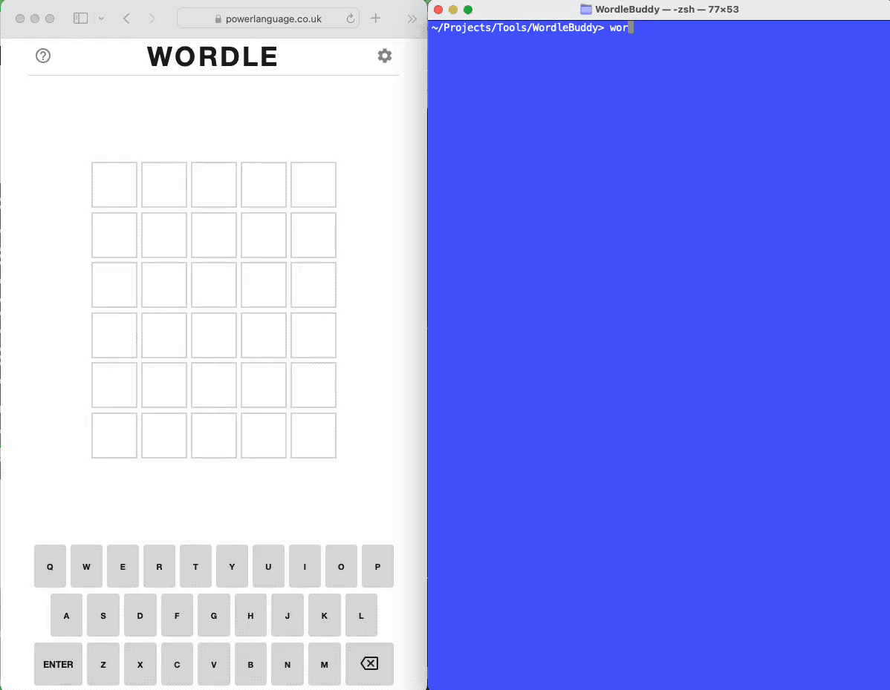

# Wordle Buddy

Summary   | Current Release
----------|-----------------------
Version   | 1.1.2
Date      | January 6, 2022
Platforms | macOS, Linux (Ubuntu+), Windows
Author    | Abe Pralle

# About
Wordle Buddy is a console-based app that assists in solving [Wordle](https://powerlanguage.co.uk/wordle/) puzzles.

# Demo

# Installation

## New Installation

1. Install [morlock.sh](https://morlock.sh)
2. `morlock install abepralle/wordlebuddy`

## Updating Existing Installation
    morlock update wordlebuddy

# Usage
    wordlebuddy

# Thanks
- [Wordle](https://powerlanguage.co.uk/wordle/) for a fun game.
- [Graham Allen](https://twitch.tv/graham) for introducing me to Wordle and inspiring me with his solver research:
    - [Wordle Solver Exploration Part 1](https://observablehq.com/@iamgrahamallen/wordle-solver-exploration)
    - [Wordle Solver Exploration Part 2](https://observablehq.com/@iamgrahamallen/wordle-solver-exploration-part-2)

